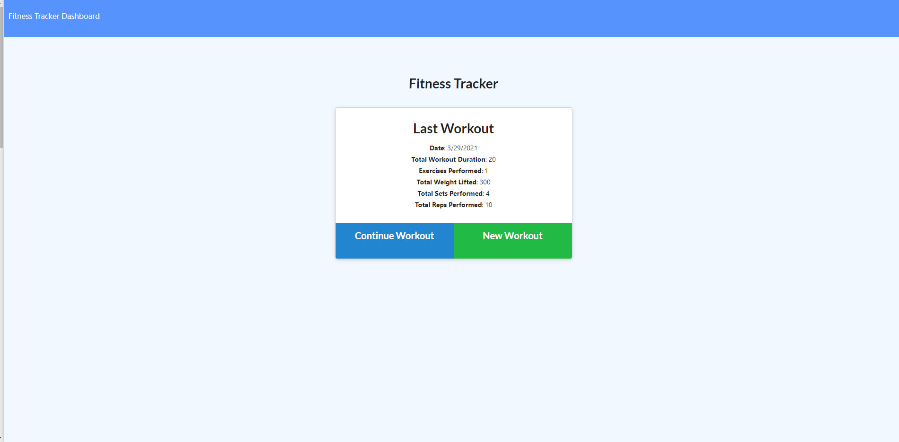
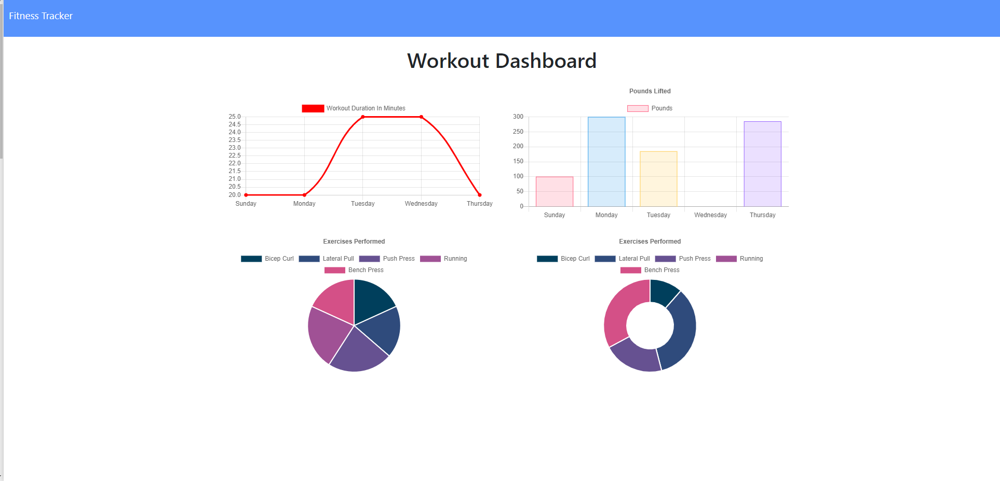

# WorkoutTracker

* A fitness app that allows the user to view, create, and track daily workouts. The user is able to log multiple exercises in a given day and also go back and update the workout.

https://mrpens-workout-track.herokuapp.com/?id=60653976f90ee900151dd597

# Table of Contents 

* [Installation](#installation)

* [Usage](#usage)

* [License](#license)

* [Questions](#questions)

# Installation For Testing

* Run Command Line, "npm install"

* Run Command Line, "node seeder/seed.js"

* Run Command Line, "node server.js"

# Usage

* As a user, I want to be able to view create and track daily workouts. I want to be able to log multiple exercises in a workout on a given day. I should also be able to track the name, type, weight, sets, reps, and duration of exercise. If the exercise is a cardio exercise, I should be able to track my distance traveled.

# License

 

# Questions

* Questions or issues, contact wtrickster at JSPenland97@gmail.com.
